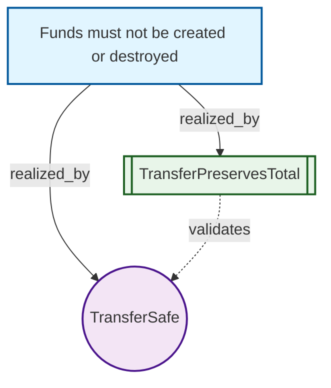

# intent-lang

[](Cargo.toml)
[](https://github.com/popsicle-lab/intent-lang/releases)

A **requirements modeling DSL** with SMT verification.  
Write business rules as logic — Z3 proves they are mutually consistent before you ship code.

> Not Dafny (no implementation proofs), not OpenAPI (no call contracts), not TLA+ (no protocol state machines).  
> intent-lang models **requirements & invariants**, then checks that they do not contradict each other.  
> See [POSITIONING.md](docs/lang/POSITIONING.md) for the full boundary.

---

## Quick start

### Install (recommended)

Download a prebuilt `intent` binary for your platform from **[Releases](https://github.com/popsicle-lab/intent-lang/releases)** (v0.1.1+ bundles Z3 — no separate install needed).

### Build from source

Requires [Rust](https://rustup.rs/), [CMake](https://cmake.org/), and a C++ toolchain (Z3 is vendored and linked statically).

```bash
git clone https://github.com/popsicle-lab/intent-lang.git
cd intent-lang
cargo build --release -p intent-lang-cli

./target/release/intent check examples/basics/transfer.intent
```

### Your first check

```intent
safety NeverNegativeBalance(a: Account) {
  invariant a.balance >= 0
}

@tobe
intent TransferSafe(sender: Account, receiver: Account, amount: Int) {
  require amount > 0
  require sender.balance >= amount
  ensure sender.balance' == sender.balance - amount
  ensure receiver.balance' == receiver.balance + amount
  invariant sender.balance' >= 0
}
```

```bash
$ intent check transfer.intent

  ✅ safety  NeverNegativeBalance  — verified
  ✅ intent  TransferSafe          — verified
```

When verification fails, Z3 returns a **counterexample** — concrete variable values that break your rules.

---

## Why intent-lang?

| Problem | How intent-lang helps |
|---------|----------------------|
| PRD rules contradict each other | `intent check` finds logical conflicts with counterexamples |
| Requirements drift from code | `.intent` files are machine-readable SSOT for downstream tools |
| LLM-generated specs are unreliable | Draft in natural language → formalize → **SMT gate** before merge |
| "Did we cover all scenarios?" | `coverage` blocks + `intent coverage` surface missing dimensions |

**Out of scope:** generating implementation code, proving algorithms correct, modeling distributed protocols, replacing unit tests or API schemas.

---

## Features

- **Declarative syntax** — `goal`, `safety`, `intent`, `theorem`, `coverage`, `@tobe` / `@asis`
- **Automatic verification** — Z3 via in-process SMT (no hand-written proofs)
- **Analysis tooling** — diff, impact, testspec, explain; JSON output for CI
- **Visual exploration** — `intent-lang-visualizer` → Mermaid graphs & interactive HTML
- **Domain plugins** — extend types and rules without changing the core language
- **LLM-friendly** — small keyword set, close to natural language; Z3 is the final judge

---

## CLI

```bash
intent check FILE.intent          # parse, type-check, verify (core command)
intent coverage FILE.intent       # completeness hints from coverage blocks
intent diff OLD NEW               # classify constraint changes
intent impact OLD NEW             # affected goals / coverage
intent testspec FILE.intent       # scenario rows for downstream test gen
intent explain FILE TARGET        # plain-English summary of a declaration
intent parse FILE.intent          # dump AST (debug)

intent --format json check FILE   # machine-readable output for CI
```

Full walkthrough: [examples/USAGE.md](examples/USAGE.md)

---

## Visualization

Turn requirements structure into graphs for PRD reviews and gap analysis:

```bash
cargo build -p intent-lang-visualizer
./tools/visualizer/demo.sh
open examples/viz-demo/billing-all/index.html
```

| Graph | Shows |
|-------|-------|
| **Goal Graph** | `goal` → `realized_by` → safety / intent / theorem |
| **Intent Graph** | Data flow between intents (`@tobe` / `@asis`) |
| **Safety Network** | Which types each `safety` rule constrains |
| **Coverage Matrix** | Scenario dimensions and uncovered combinations |

**Example** — goal traceability from [transfer.intent](examples/basics/transfer.intent):



Gallery: [examples/viz-demo/](examples/viz-demo/) · Tool docs: [tools/visualizer/README.md](tools/visualizer/README.md)

---

## Documentation

### 📘 Language

| Document | What you'll learn |
|----------|-------------------|
| [Positioning](docs/lang/POSITIONING.md) | What intent-lang **is / is not** — the top-level anchor for all design decisions |
| [5-minute overview](docs/lang/README.md) | Core concepts at a glance |
| [Syntax specification](docs/lang/SPEC.md) | Full EBNF, expression precedence, SMT encoding |
| [Design decisions](docs/lang/DECISIONS.md) | Why hybrid syntax, SMT verification, and Rust |
| [LLM integration](docs/lang/LLM.md) | LLM-assisted drafting + Z3 gatekeeping |

### 🏗 Architecture

| Document | What you'll learn |
|----------|-------------------|
| [Plugin system](docs/architecture/PLUGINS.md) | 4-layer plugin model and domain examples |
| [Execution architecture](docs/architecture/EXECUTION.md) | 4-layer bridge: intent → plan → execute → verify |

### 🎯 Use Cases

| Document | What you'll learn |
|----------|-------------------|
| [Software development](docs/software/README.md) | PRD → intents → verification → tests / assertions / API contracts |
| [Smart home](docs/smarthome/README.md) | Safety verification, conflict detection, platform comparison |

### 🛠 Tools

| Document | What you'll learn |
|----------|-------------------|
| [intent-lang-visualizer](tools/visualizer/README.md) | Goal / intent / safety / coverage graphs, Mermaid & interactive HTML |
| [viz-demo gallery](examples/viz-demo/README.md) | Pre-built demos and regeneration workflow |
| [CLI usage guide](examples/USAGE.md) | Full command-line walkthrough |

### 📂 Examples

| File | Description |
|------|-------------|
| [requirements/billing.intent](examples/requirements/billing.intent) | Requirements-modeling style — `goal` / `safety` / `@tobe` / `coverage` |
| [basics/transfer.intent](examples/basics/transfer.intent) | Transfer verification + `@asis` counterexample demo |
| [viz-demo/](examples/viz-demo/) | Interactive visualization gallery |

Also see [PLAN.md](PLAN.md) (roadmap) and [CHANGELOG.md](CHANGELOG.md).

---

## Development

```bash
cargo test --workspace              # run all tests
cargo build -p intent-lang-cli           # CLI only
cargo build -p intent-lang-visualizer    # visualization tool
```

| Component | Stack |
|-----------|-------|
| Parser | `logos` + recursive descent |
| Verifier | Z3 (`z3` crate, `vendored`) |
| CLI | `clap` |
| Grammar (editor) | [tools/grammar/intent.tmLanguage.json](tools/grammar/intent.tmLanguage.json) |

---

## Contributing

Contributions welcome — issues, docs, examples, and tooling improvements especially.

1. Fork & branch from `main`
2. `cargo test --workspace` must pass
3. Open a PR with a clear description of the change

For large language or architecture changes, read [POSITIONING.md](docs/lang/POSITIONING.md) first — scope creep into "implementation language" or "protocol modeling" is intentionally out of bounds.

---

## License

[MIT](Cargo.toml) — see workspace `Cargo.toml` for the SPDX identifier.
