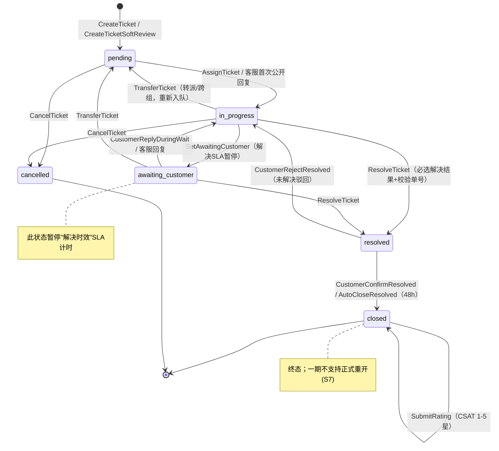

# B2C 实物电商客服工单系统 — 产品需求文档（一期）

> **版本**：1.0  
> **日期**：2026-07-15  
> **关联需求模型**：[`examples/requirements/ticket.intent`](../../examples/requirements/ticket.intent)  
> **验证命令**：`intent check examples/requirements/ticket.intent`

---

## 1. 文档目的与范围

本文档描述 **B2C 实物电商** 在 **App/网站内「我的客服」** 渠道的 **一期工单系统** 产品需求。可形式化验证的业务规则（状态机、售后政策、结案条件等）已同步写入 `ticket.intent`；本文档补充 UI 交互、通知文案、看板布局、i18n 等产品叙述细节。

### 1.1 一期做什么

- B2C 个人用户的异步工单（非实时 IM）
- 5 类工单：物流、退货、仅退款、质量、售前
- 角色：客户、一线客服、主管、系统自动化
- 技能组自动分配 + 转派/改派
- SLA 计时、优先级、CSAT 评价
- 简中 + 英文多语言
- 售后政策基础规则引擎（P1–P6）
- 订单/物流只读对接；退款/退货回填外部单号

### 1.2 一期明确不做

| 代号 | 排除项 |
|------|--------|
| X1 | 邮件/电话/第三方平台/社媒渠道 |
| X2 | 工单内一键发起退款/退货 API |
| X3 | 完整重开工单（S7）；用 resolved 驳回代替 |
| X4 | 二线专家独立角色 |
| X5 | 仓储/物流人员登录工单系统 |
| X6 | VIP 差异化 SLA |
| X7 | 换货 T3、发票 T8、优惠券 T9、投诉升级 T10 |
| X8 | 实时 IM 聊天 |
| X9 | 客服绩效排名、自定义 BI、Excel 导出 |
| X10 | 客户短信通知 |
| X12 | 工单合并、批量操作 |
| X13 | AI 自动回复/智能分类 |

**二期优先候选**：S7 重开、T10 投诉升级、Excel 导出、消息自动翻译。

---

## 2. 用户与角色

| 角色 | 代号 | 一期权限摘要 |
|------|------|--------------|
| 客户 | R1 | 创建工单、公开回复、上传凭证、确认/驳回结案、评价、申请加急 |
| 一线客服 | R2 | 接单、公开回复、内部备注、改状态、转派、提升优先级至「紧急」、发起售后后回填单号 |
| 客服主管 | R3 | R2 全部能力 + 强制改派、设「重大」优先级、编辑内部备注、全组看板 |
| 系统 | R6 | 自动分配、SLA 计时/提醒、自动关单、通知投递 |

---

## 3. 工单类型

| 代号 | 类型 | 典型诉求 | 默认技能组 |
|------|------|----------|------------|
| T1 | 物流查询 | 物流进度、催发货 | 售后组 |
| T2 | 退货申请 | 7 天无理由退货 | 售后组 |
| T4 | 仅退款 | 未收货/少件/协商退款 | 售后组 |
| T5 | 商品质量问题 | 破损、瑕疵、功能异常 | 售后组 |
| T7 | 售前咨询 | 商品、活动规则 | 售前组 |

---

## 4. 状态机

文本简版：`pending → in_progress ↔ awaiting_customer → resolved → closed`，外加 `cancelled`（仅早期）。

| 状态 | 英文键 | 说明 |
|------|--------|------|
| 待分配 | `pending` | 客户已提交，等待分配客服 |
| 处理中 | `in_progress` | 已分配客服，正在处理 |
| 待客户回复 | `awaiting_customer` | 等客户补充信息 |
| 已解决 | `resolved` | 客服认为已处理完，待客户确认 |
| 已关闭 | `closed` | 终结态 |
| 已取消 | `cancelled` | 客户主动撤销 |

### 4.1 关键流转规则

- 客户仅在 `pending` / `in_progress`（客服未实质处理前）可 **取消**。
- 客服首次 **公开回复** 时，若仍为 `pending` 则进入 `in_progress`；该回复计入 **首响 SLA**。
- 客服可将状态改为 `awaiting_customer`；此期间 **解决 SLA 暂停**。
- 客服标记 `resolved` 时必须选择解决结果（见 §8）。
- 客户在 `resolved` 可点 **「已解决」** → `closed`，或 **「未解决」** → `in_progress`。
- `resolved` 满 **48 小时** 客户无操作，R6 自动 `closed`（提前 12h 提醒客户）。
- 一期 **不支持** 从 `closed` 正式重开（二期 S7）。

---

## 5. 分配策略

**模式 E：混合自动分配**

1. 客户提交 → `pending`，按工单类型路由技能组（T7 → 售前，其余 → 售后）。
2. 组内按 **优先级（重大 > 紧急 > 普通）** + **等待时长 FIFO** 自动分配给 R2。
3. 分配算法：当前在手工单数最少者优先（负载均衡）。
4. R2 可 **转派** 给同组同事；跨组转派需选目标组并重新进入该组分配队列。
5. R3 可对任意 `pending` / `in_progress` 工单 **强制改派**。
6. **不做抢单模式**。

---

## 6. SLA

### 6.1 计时规则

| 项 | 规则 |
|----|------|
| 工作时区 | 统一 `Asia/Shanghai`（UTC+8） |
| 工作时段 | 每天 09:00–21:00 |
| 节假日 | 一期不考虑，仅按周一至周日 |
| 暂停 | 工单在 `awaiting_customer` 时，解决时效暂停 |
| 非工作时段 | 客户可建单；SLA 从下一工作时段起点计 |

### 6.2 时限（按类型）

| 类型 | 首响 | 解决 |
|------|------|------|
| T1 物流 | 30 分钟 | 24 小时 |
| T2/T4/T5 售后 | 2 小时 | 72 小时 |
| T7 售前 | 4 小时 | 48 小时 |

- **首响** = 进入 `pending` → R2/R3 首次 **公开回复**（系统模板 **不算**）。
- **解决** = 进入 `pending` → 首次进入 `resolved`（扣除 S3 暂停时长）。
- **不区分** 会员等级。

### 6.3 超时动作

| 事件 | 动作 |
|------|------|
| 首响剩余 5 分钟 | 工作台提醒 R2 |
| 首响超时 | 提醒 R2 + 通知 R3；R3 收邮件 |
| 解决剩余 2 小时 | 工作台提醒 R2 |
| 解决超时 | 标红 + 主管看板置顶 + R3 邮件 |

---

## 7. 优先级

| 级别 | 默认 | 谁能调整 | 分配影响 |
|------|------|----------|----------|
| 普通 | 新建默认 | — | 标准排序 |
| 紧急 | 客户申请或 R2 提升 | R2 可提升；每客户同时 **≤1 单** | 插队于普通之前 |
| 重大 | 单笔订单金额 ≥1000 元或 R3 标记 | 仅 R3 | 最高优先 |

- 优先级 **不改变** SLA 数字阈值。
- 客户申请加急需勾选确认语；一期不做信用分惩罚。

---

## 8. 结案与解决结果

### 8.1 解决结果枚举

| 代号 | 结果 | 说明 |
|------|------|------|
| O1 | 已解答 | 咨询类结案 |
| O2 | 已发起退货 | 已创建 RMA |
| O3 | 已发起退款 | 已创建退款单 |
| O4 | 已补发/协商一致 | 补发或补偿 |
| O5 | 无法支持 | 超政策，已向客户说明 |
| O6 | 重复/无效 | 重复单、恶意、误操作 |

### 8.2 按类型的允许结果与硬性字段

| 类型 | 允许结果 | 标记 resolved 前必填 |
|------|----------|----------------------|
| T1 | O1、O5 | 无 |
| T2 | O2、O5 | O2 → **退货单号（RMA）** |
| T4 | O3、O5 | O3 → **退款单号** |
| T5 | O3、O4、O5 | O3 → 退款单号；O4 → 补发订单号或补偿说明 |
| T7 | O1、O5 | 无 |

### 8.3 客户确认

- 进入 `resolved` 后，客户可 **确认**（→ `closed`）或 **驳回**（→ `in_progress`）。
- O6 对客户展示为「已关闭」，不展示为「已解决」。

---

## 9. 创建表单

### 9.1 通用字段

| 字段 | 必填 | 说明 |
|------|------|------|
| 工单类型 | 是 | T1/T2/T4/T5/T7 |
| 问题描述 | 是 | 10–2000 字 |
| 订单号 | 否 | 填则实时校验归属 |
| 关联商品 | 否 | 有订单时可选 SKU |
| 联系电话 | 否 | 默认账号手机号 |
| 图片凭证 | 条件 | 见下表 |

### 9.2 按类型规则

| 类型 | 额外必填 | 图片 |
|------|----------|------|
| T1 | — | 选填，≤3 张 |
| T2 | 退货原因枚举 | 选填，≤6 张 |
| T4 | 退款原因枚举 | 选填，≤6 张 |
| T5 | 问题类别枚举 | **必填** ≥1 张，≤6 张 |
| T7 | 咨询对象枚举 | 选填，≤3 张 |

### 9.3 附件约束

- 格式：JPG / PNG / HEIC
- 单张 ≤ 5MB，单工单总计 ≤ 20MB
- 禁止上传身份证、银行卡等敏感信息（提交前提示）

### 9.4 防滥用

| 规则 | 阈值 |
|------|------|
| 单用户未关闭工单上限 | 5 单 |
| 同订单进行中售后单（T2/T4/T5） | 1 单 |
| 24h 内同类型重复 | 提示并引导查看已有工单 |

---

## 10. 售后政策引擎（P1–P6）

| 规则 | 适用 | 逻辑 | 失败处理 |
|------|------|------|----------|
| P1 订单归属 | 填了订单号 | 订单属于当前用户 | **硬拒绝** |
| P2 退货时效 | T2 | 签收/完成后 ≤7 天（可配置） | **硬拒绝** |
| P3 售后唯一 | T2/T4/T5 | 同订单同 SKU 无进行中售后单 | **硬拒绝** |
| P4 仅退款边界 | T4 | 已发货未签收或签收 24h 内少件 | 不符合 → **软标记**「需人工审核」 |
| P5 质量时效 | T5 | 签收后 ≤15 天（可配置） | **硬拒绝** |
| P6 不可退商品 | T2/T4/T5 | 订单行 `nonReturnable=false` | **硬拒绝** |

- P2/P4/P5 天数存运营配置表，R3 可改，无需发版。
- 规则校验结果写入审计日志。

---

## 11. 沟通记录

| 类型 | 可见范围 | 计首响 |
|------|----------|--------|
| 公开回复 | 客户 + 客服 | 人工回复算；系统模板不算 |
| 内部备注 | 仅 R2/R3 | 否 |

### 11.1 权限

| 角色 | 公开回复 | 内部备注 |
|------|----------|----------|
| R1 客户 | S2/S3/S4 可发；S5/S6 只读 | 不可 |
| R2 | 非关闭态可发 | 非关闭态可发 |
| R3 | 同 R2 | 同 R2；可编辑他人备注（审计留痕） |
| R6 | 模板通知 | 不可 |

- 公开回复支持文字 + 图片（≤3 张/条）。
- 消息 **不可撤回**；主管可标记「发送错误」并追加更正说明。
- 一期不支持语音/视频。

---

## 12. 外部系统对接

| 系统 | 一期深度 | 说明 |
|------|----------|------|
| I1 订单 | 只读 + 归属校验 | 带出商品、金额、状态、`nonReturnable` |
| I2 物流 | 只读轨迹 | T1 侧边栏展示 |
| I3 售后/退款 | 回填单号 | R2 在售后后台操作后录入 RMA/退款单号 |
| I4 商品 | 随订单行 | 不独立查 SKU |
| I5 用户 | 登录态 | 不拉会员等级 |

- 外部接口超时 3s 降级提示，不阻塞建单。

---

## 13. 通知

### 13.1 客户（R1）

| 事件 | App 推送 | 站内信 |
|------|----------|--------|
| 创建成功 | ✓ | ✓ |
| 客服公开回复 | ✓ | ✓ |
| 进入 resolved | ✓ | ✓ |
| 自动关闭前 12h | ✓ | ✓ |
| 已关闭 | ✓ | ✓ |

- 客户可关闭推送，站内信保留。
- 一期不发短信。

### 13.2 客服（R2/R3）

| 事件 | 工作台 | 邮件 |
|------|--------|------|
| 新单分配 | ✓ | — |
| 客户新回复 | ✓ | — |
| SLA 临近/超时 | ✓ | R3 超时收邮件 |

- 客服侧通知不可关闭。

---

## 14. 满意度评价（CSAT）

| 项 | 规则 |
|----|------|
| 触发 | 客户确认关闭时立即弹窗；48h 自动关闭后下次打开 App 引导 |
| 频次 | 每工单仅 1 次 |
| 内容 | 1–5 星（必填）+ 文字（选填，≤500 字） |
| 修改 | 7 天内可改 1 次 |
| 低分 | ≤2 星通知 R3，不自动重开 |

---

## 15. 客服工作台

### 15.1 默认视图

- **我的工单**：当前 R2 的 S2/S3，按优先级 → SLA 风险 → 更新时间。
- **组内待分配**：本组 S1（只读监控，非抢单）。

### 15.2 筛选

工单号、状态、类型、优先级、SLA 超时、需人工审核、分配人、创建时间。

### 15.3 搜索

| 字段 | 方式 |
|------|------|
| 工单号 / 订单号 | 精确 |
| 用户 ID / 手机后 4 位 | 精确/后缀 |
| 描述关键词 | 模糊，≥2 字符 |

---

## 16. 主管看板（R3）

### 16.1 实时

- 各组 S1 数量与最久等待
- SLA 风险列表（可一键改派）
- 客服负载
- CSAT ≤2 星列表（近 7 天）

### 16.2 统计（日/周）

工单量、首响/解决达标率、平均首响/解决时长、评价率与均分、解决结果分布。

### 16.3 权限

- R3：全组数据
- R2：仅自己的工单 + 简易「我的今日」卡片
- R1：无报表

---

## 17. 多语言（i18n）

| 项 | 一期规则 |
|----|----------|
| 语言 | 简体中文 + 英文 |
| 翻译范围 | C 端界面、客服工作台、系统通知/推送/站内信、枚举选项、报表表头 |
| 不翻译 | 客户/客服自由输入的消息正文 |
| 切换 | 默认跟随 App 系统语言，设置可覆盖 |
| 工单锁定 | 创建时锁定语言；该工单后续通知与状态文案用此语言 |
| 时间展示 | 客户侧按锁定时区显示；客服/主管默认 UTC+8，可切换本地 |
| 二期 | 消息自动翻译、RTL、按语言技能组路由 |

---

## 18. 非功能需求

| 类别 | 指标 |
|------|------|
| 容量 | 日新建 ≤10,000；并发客服 ≤200；并发客户浏览 ≤5,000 |
| 响应 P95 | 建单 <2s；详情 <1.5s；列表 <2s；看板 <3s |
| 可用性 | 99.9%/月；维护窗周二 02:00–04:00 |
| 保留 | 在线 3 年，之后归档冷存储 |
| 审计 | 状态变更、改派、优先级、结案、主管改备注全量留痕 |
| 隔离 | 客户仅见自己工单；R2 仅见本组/分配给自己的 |
| 附件 | 私有存储 + 鉴权 URL，15 分钟有效 |

---

## 19. 与 intent 模型的映射

| PRD 章节 | ticket.intent 构造 |
|----------|-------------------|
| §4 状态机 | `TicketStatus` enum + `AssignTicket` / `ResolveTicket` 等 intent |
| §7 优先级 | `Priority` enum + `CustomerRequestUrgent` / `SupervisorSetCritical` |
| §8 结案 | `ResolutionOutcome` + `ResolveTicket` require/ensure |
| §9 防滥用 | `CreateTicket` `under_limit` |
| §10 政策 | `PolicyP2`–`P6` safety + `CreateTicket` require |
| §10 P4 软标记 | `CreateTicketSoftReview` intent |

---

## 20. 验收建议（testspec 方向）

> 完整可执行验收需在 **独立会话** 中用 `implement-testspec` 技能编写 binding，遵循反勾结原则。

建议覆盖场景：

1. 无订单创建 T1 成功
2. 超 7 天 T2 硬拒绝
3. 第 6 张未关闭工单硬拒绝
4. T4 边界案例带「需人工审核」标记
5. 退货结案无 RMA 硬拒绝
6. 客户驳回 resolved → in_progress
7. 客户加急第二单硬拒绝
8. 简中/英文创建后通知语言锁定

---

## 附录 A：术语表

| 术语 | 含义 |
|------|------|
| 首响 | 第一个人工公开回复 |
| 软标记 | 允许建单但加业务标签 |
| 技能组 | 售后组 / 售前组 |
| RMA | 退货授权单号 |

## 附录 B：修订记录

| 版本 | 日期 | 说明 |
|------|------|------|
| 1.0 | 2026-07-15 | 初始版，源自 grilling 会话 25 项决策 |
