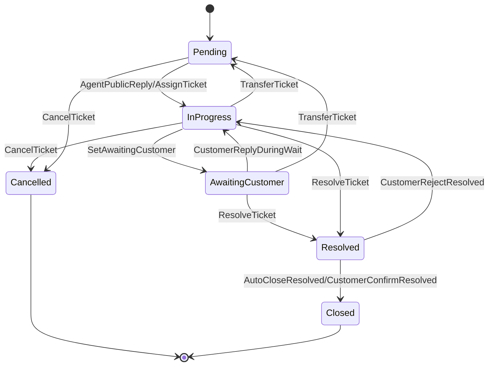

# 工单系统需求可视化（业务导读）

> 面向**业务方 / 需求评审**的可视化导读。源模型：[`examples/requirements/ticket.intent`](../../requirements/ticket.intent)；完整叙述见 [PRD](../../../docs/requirements/ticket-system-prd.md)。
>
> 交互式版本：在浏览器打开 [`ticket.html`](./ticket.html)。

---

## 1. 工单状态机（最重要，先看这张）

这是理解工单业务流转的核心。**由工具自动从 `.intent` 推导**（`require` 前置状态 → `ensure` 后置状态），每条边标注触发它的操作。生成命令：

```bash
cargo run -p intent-lang-visualizer -- examples/requirements/ticket.intent --type state-machine
```

最新产物见 [`statemachine.mmd`](./statemachine.mmd)：



**怎么读**：
- 圆点 `[*]` 是工单的诞生与消亡。
- `AwaitingCustomer` 期间"解决时效"SLA 暂停——这是客服 SLA 的关键业务规则（见 PRD §6.1）。
- `Resolved` 有两条出边：客户确认/超时 → `Closed`；客户驳回 → 回 `InProgress`。
- `Closed` / `Cancelled` 是终态；一期不支持从 `Closed` 正式重开。
- 这张图**自动跟随 `.intent` 变化**：新增/删除状态转换 intent 会即时反映，比手绘图更可信。

---

## 2. 目标追溯图（Goal Graph）

展示 7 个业务目标如何被 safety 规则与 intent 操作落地。适合回答"这条需求是为哪个业务目标服务的"。

- 蓝色 = 业务目标（goal）
- 橙色 = 安全不变量（safety，恒久约束）
- 紫色 = 操作意图（intent，状态变更契约）

完整图见 [`goalgraph.mmd`](./goalgraph.mmd) 或交互页。

---

## 3. 安全规则网络（Safety Network）

展示每条 safety 规则约束了哪些领域类型（`Customer` / `Order` / `Ticket` / `SlaPolicy` / `Rating`）。适合做安全/合规审计的 gap 分析。见 [`safetynetwork.mmd`](./safetynetwork.mmd)。

---

## 4. 覆盖矩阵（Coverage Matrix）— 请注意口径

`ticket-domain` 声明了 **5 类型 × 6 状态 × 3 优先级 = 90** 个场景维度组合。

> ⚠️ **关于图中 `Covered: 0 | Missing: 90`**：这不代表"需求没做"。该数字是可视化工具的**静态引用启发式**——它只检查是否有 safety/intent 在文本里"点名"了每个笛卡尔积组合，而我们的规则用的是蕴含式条件（如 `ticketType == Return ==> ...`）而非逐组合枚举，因此静态计数显示为未覆盖。
>
> **真实的覆盖证据**在 `intent check`（全部 verified）和 `intent testspec`（为每条 require 派生了 happy-path + reject 场景）。Coverage 图仅用作"是否遗漏了某个维度组合"的**人工提示**，不是覆盖率结论。

---

## 5. 关于旧的 Intent Graph（已被状态机图取代）

工具早期的 Intent Graph 用"共享参数类型即连边"的规则画意图关系图。由于本系统几乎所有 intent 都操作 `Ticket` 类型，会产生 N×N 的全连接噪声边，对理解业务无信息量甚至误导。

现已在可视化工具中**用自动推导的状态机图（第 1 节）取代它**在 `--all` 与交互页中的位置。理解意图之间的先后与流转，以状态机图为准。若仍需旧图，可显式执行 `--type intent-graph`。

---

## 重新生成

```bash
cargo run -p intent-lang-visualizer -- examples/requirements/ticket.intent --all --output-dir examples/viz-demo/ticket
cargo run -p intent-lang-visualizer -- examples/requirements/ticket.intent --interactive -o examples/viz-demo/ticket/ticket.html
```
