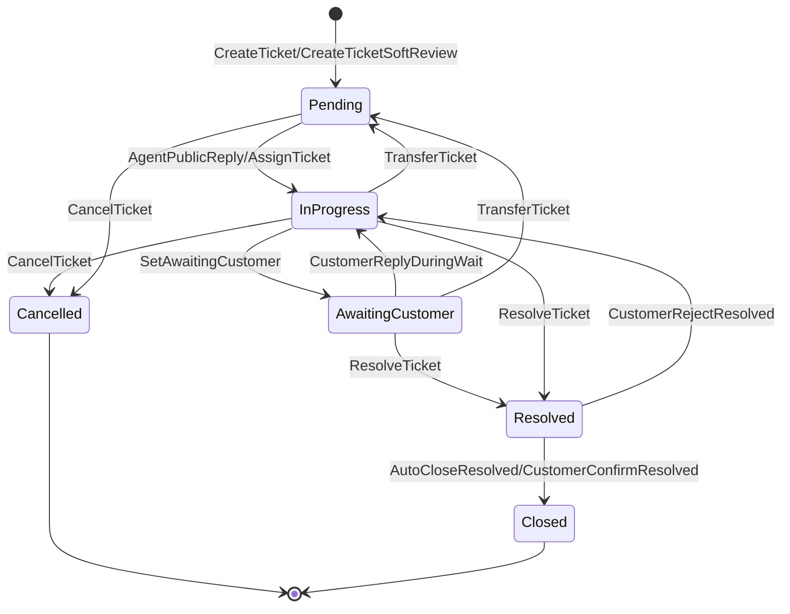

# 工单系统需求可视化

B2C 实物电商客服工单系统的需求可视化。源模型：[`examples/requirements/ticket.intent`](../../requirements/ticket.intent)；完整叙述见 [PRD](../../../docs/requirements/ticket-system-prd.md)。

**打开 [`index.html`](./index.html) 看交互版**——状态机、目标追溯、安全规则、覆盖备忘、带高亮的源码都在一个页面里，点任意节点/行看完整契约。这份 README 只是 GitHub 上不便打开 HTML 时的预览，读法说明已经内化进页面本身，不在这里重复。

## 生命周期状态机（预览）



由工具从 `.intent` 的 `require` 前置状态 → `ensure` 后置状态自动推导，跟随需求变化——图不会与实现脱节。

## 重新生成

```bash
cargo run -p intent-lang-visualizer -- examples/requirements/ticket.intent --all --output-dir examples/viz-demo/ticket
```

`--all` 会写出 `.mmd`（供 Markdown 嵌入/下载）与 `index.html`（交互页，同一模板，等价于单独执行 `--interactive -o index.html`）。安全规则的二部图视图已退役（并入交互页的规则清单表），仍可显式生成：

```bash
cargo run -p intent-lang-visualizer -- examples/requirements/ticket.intent --type safety-network
```
