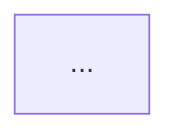

# HTML 渲染问题修复说明

## 问题描述

在浏览器中打开生成的交互式HTML时，Mermaid图表显示 "Syntax error in text" 错误。

## 根本原因

HTML生成器将Mermaid代码包含在Markdown代码围栏标记中（\`\`\`mermaid ... \`\`\`），但Mermaid.js在HTML中渲染时不需要这些标记。

### 错误示例
```html
<div class="mermaid">

</div>
```

Mermaid.js尝试解析时会把 \`\`\`mermaid 当作图表内容的一部分，导致语法错误。

## 解决方案

修改 `html_generator.rs`，在嵌入HTML之前移除代码围栏标记：

```rust
// 移除 markdown 代码围栏标记
let goal_mermaid = goal_graph_mermaid
    .trim()
    .trim_start_matches("```mermaid")
    .trim_end_matches("```")
    .trim();
```

### 正确示例
```html
<div class="mermaid">
graph TD
  转账绝不能凭空创造或销毁资金[...]:::goalNode
  ...
</div>
```

## 文件格式说明

### .mmd 文件（Markdown嵌入式）
**保留** 代码围栏标记，用于在Markdown文件中嵌入：

```markdown
# 架构图

\`\`\`mermaid
graph TD
  ...
\`\`\`
```

### .html 文件（HTML嵌入式）
**移除** 代码围栏标记，直接是Mermaid DSL：

```html
<div class="mermaid">
graph TD
  ...
</div>
```

## 验证方法

### 1. 检查HTML源码
```bash
grep -A 3 '<div class="mermaid">' examples/viz-demo/transfer-interactive.html
```

应该看到：
```html
<div class="mermaid">
graph TD
    转账绝不能凭空创造或销毁资金[...]
```

**不应该**看到 \`\`\`mermaid 标记。

### 2. 在浏览器中测试
```bash
open examples/viz-demo/transfer-interactive.html
```

应该正常显示彩色的流程图，而不是错误消息。

### 3. 检查控制台
打开浏览器开发者工具（F12），Console标签不应该有Mermaid相关错误。

## 相关修改

- `tools/visualizer/src/html_generator.rs` - 添加代码围栏标记移除逻辑
- `tools/visualizer/src/mermaid.rs` - Mermaid渲染器保持不变（生成带标记的.mmd文件）

## 重新生成所有文件

```bash
# 删除旧文件
rm -rf examples/viz-demo

# 运行演示脚本
./tools/visualizer/demo.sh

# 在浏览器中验证
open examples/viz-demo/transfer-interactive.html
```

## 状态

✅ 已修复并测试通过

生成的HTML文件现在可以正常在浏览器中显示Mermaid图表。

## 补充：多标签页（隐藏 tab）渲染失败

### 症状

`billing-all/index.html` 中第 3 个标签 **Safety Network** 显示 `Syntax error in text`，
而单独打开同一份 `.mmd` 文件却正常。

### 原因

Mermaid 10 在 `startOnLoad: true` 时会一次性渲染页面上所有 `.mermaid` 块。
处于 `display: none` 的隐藏标签页没有布局尺寸，导致渲染失败。

### 修复

`html_generator.rs` 改为 **懒加载**：

1. `mermaid.initialize({ startOnLoad: false })`
2. 页面加载时只渲染当前激活标签
3. `switchTab()` 切换时再渲染目标标签（`mermaid.render()`）

同时修正了带标签边的 Mermaid 语法：`A -->|label| B`（箭头与 `|label|` 之间不能有空格）。
