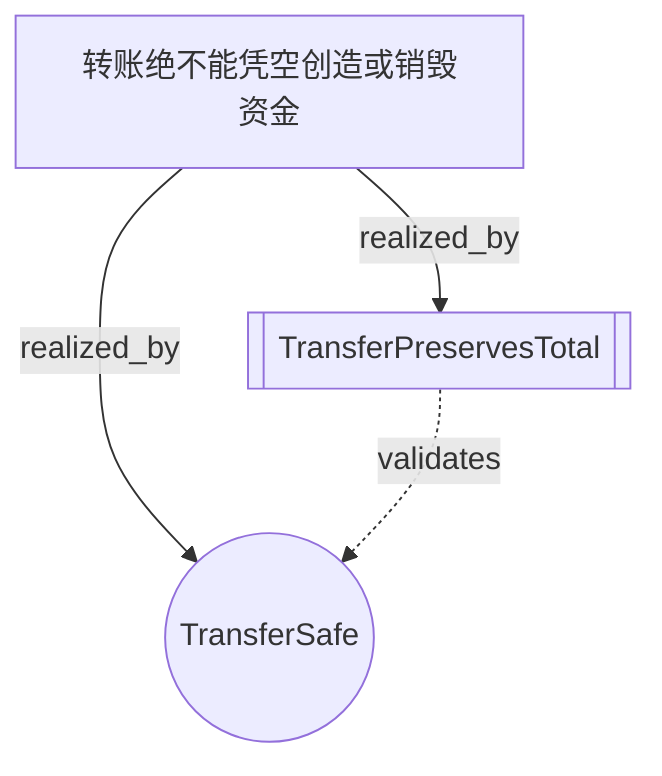

# Intent-Lang 可视化工具使用指南

## 概述

intent-visualizer 是一个强大的工具，可以将 `.intent` 文件转换为多种可视化图形，帮助理解和分析业务意图的结构。

## 安装

```bash
cargo build --release -p intent-visualizer
# 可执行文件位于: target/release/intent-visualizer
```

## 快速开始

### 1. 生成目标依赖图

```bash
intent-visualizer examples/basics/transfer.intent --type goal-graph
```

输出Mermaid格式的依赖图，显示：
- 🎯 业务目标（Goal）
- 🛡️ 安全规则（Safety）
- 🔄 意图声明（Intent）
- ✅ 定理证明（Theorem）

### 2. 生成交互式HTML

```bash
intent-visualizer examples/basics/transfer.intent --interactive -o visualization.html
```

生成包含所有可视化类型的交互式HTML页面，可在浏览器中查看。

### 3. 生成完整可视化套件

```bash
intent-visualizer examples/requirements/billing.intent --all --output-dir ./billing-viz
```

在 `./billing-viz` 目录下生成：
- goal-graph.mmd - 目标依赖图
- intent-graph.mmd - 意图关系图
- safety-network.mmd - 安全规则网络
- coverage-matrix.mmd - 完备性矩阵
- index.html - 索引页面

## 可视化类型

### Goal Graph（目标依赖图）

展示业务目标如何通过安全规则、意图和定理实现。

```bash
intent-visualizer transfer.intent --type goal-graph --format mermaid
```

**用途：**
- 理解业务目标的实现路径
- 追溯需求来源
- 识别未实现的目标

### Intent Graph（意图关系图）

展示意图之间的数据流和依赖关系，按 `@tobe`/`@asis` 分组。

```bash
intent-visualizer smarthome.intent --type intent-graph
```

**用途：**
- 识别意图之间的耦合
- 规划实现顺序
- 发现循环依赖

### Safety Network（安全规则网络）

展示安全规则覆盖的类型和约束维度。

```bash
intent-visualizer billing.intent --type safety-network --format dot
```

**用途：**
- 审计安全规则覆盖范围
- 识别缺失的约束
- 理解类型之间的关系

### Coverage Matrix（完备性矩阵）

可视化 `coverage` 声明的多维度测试场景。

```bash
intent-visualizer billing.intent --type coverage-matrix
```

**用途：**
- 评估测试完备性
- 识别未覆盖的场景组合
- 指导测试用例设计

### Verification Flow（验证流程图）

展示单个意图的验证条件生成过程。

```bash
intent-visualizer transfer.intent --type verification-flow
```

**用途：**
- 理解验证逻辑
- 调试验证失败
- 教学演示

## 输出格式

### Mermaid（推荐）

Markdown可嵌入格式，可在GitHub、Notion等平台直接渲染。

```bash
intent-visualizer transfer.intent --format mermaid > docs/architecture.md
```

在Markdown中使用：
\`\`\`mermaid
graph TD
  ...
\`\`\`

### Graphviz DOT

适合复杂图形，需要安装Graphviz。

```bash
intent-visualizer transfer.intent --format dot | dot -Tpng > graph.png
```

### JSON

适合Web应用集成（D3.js等）。

```bash
intent-visualizer transfer.intent --format json > data.json
```

### SVG

独立SVG图片，可直接插入文档。

```bash
intent-visualizer transfer.intent --format svg > graph.svg
```

需要安装Graphviz：
```bash
# macOS
brew install graphviz

# Ubuntu/Debian
sudo apt-get install graphviz
```

## 集成到工作流

### CI/CD 自动生成文档

```yaml
# .github/workflows/docs.yml
name: Generate Intent Visualizations

on:
  push:
    paths:
      - '**/*.intent'

jobs:
  visualize:
    runs-on: ubuntu-latest
    steps:
      - uses: actions/checkout@v3
      - uses: actions-rs/toolchain@v1
        with:
          toolchain: stable
      - name: Build visualizer
        run: cargo build --release -p intent-visualizer
      - name: Generate visualizations
        run: |
          mkdir -p docs/viz
          for file in examples/**/*.intent; do
            name=$(basename "$file" .intent)
            ./target/release/intent-visualizer "$file" \
              --all --output-dir "docs/viz/$name"
          done
      - name: Commit visualizations
        run: |
          git add docs/viz
          git commit -m "Update intent visualizations" || exit 0
          git push
```

### Pre-commit Hook

```bash
# .git/hooks/pre-commit
#!/bin/bash
for file in $(git diff --cached --name-only | grep '\.intent$'); do
  intent-visualizer "$file" --type goal-graph \
    -o "docs/viz/$(basename $file .intent)-goals.mmd"
done
```

### VS Code Task

```json
// .vscode/tasks.json
{
  "version": "2.0.0",
  "tasks": [
    {
      "label": "Visualize Current Intent",
      "type": "shell",
      "command": "intent-visualizer",
      "args": [
        "${file}",
        "--interactive",
        "-o",
        "${fileDirname}/${fileBasenameNoExtension}-viz.html"
      ],
      "problemMatcher": [],
      "presentation": {
        "reveal": "silent"
      }
    }
  ]
}
```

## 高级用法

### 批量处理

```bash
find . -name "*.intent" -exec intent-visualizer {} \
  --type goal-graph -o {}.mmd \;
```

### 组合多个图形

```bash
# 生成目标图和意图图，合并到一个文档
{
  echo "# Transfer Intent Analysis"
  echo "## Goal Dependencies"
  intent-visualizer transfer.intent --type goal-graph
  echo "## Intent Relationships"
  intent-visualizer transfer.intent --type intent-graph
} > transfer-complete.md
```

### 自定义样式

Mermaid输出可以通过CSS自定义：

```html
<style>
  .mermaid .goalNode {
    fill: #your-color !important;
  }
</style>
```

## 故障排除

### "Parse error"

确保 `.intent` 文件语法正确：
```bash
intent check your-file.intent
```

### SVG生成失败

确认已安装Graphviz：
```bash
dot -V
```

### 中文显示问题

在生成的HTML中确保使用UTF-8编码。

## 示例输出

### transfer.intent 的目标依赖图



### smarthome.intent 的意图关系图

显示ArriveHome、GoodNight、LeaveHome等意图之间的Home类型数据流。

## 贡献

欢迎贡献新的可视化类型或改进现有功能！

## 许可证

MIT
