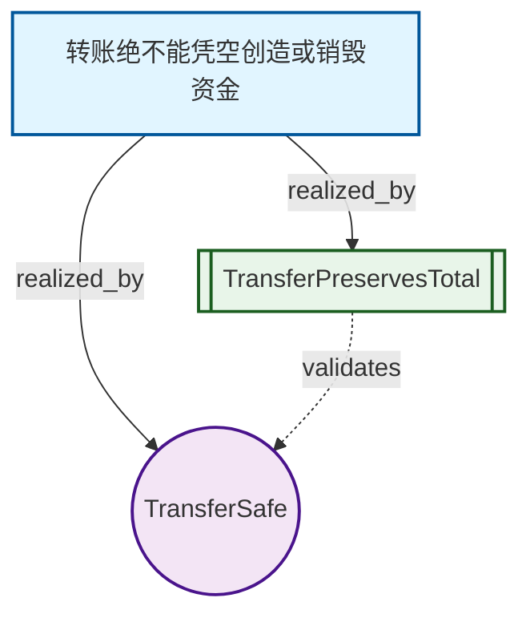

# Intent-Lang Visualizer

> 将业务意图转换为直观的可视化图形

[]()
[]()

## 简介

intent-lang-visualizer 是 intent-lang 的配套工具，可以将 `.intent` 文件转换为多种可视化图形，帮助团队更好地理解和分析业务意图的结构。

## 快速开始

### 安装

```bash
cargo build --release -p intent-lang-visualizer
```

### 基础用法

```bash
# 生成目标依赖图
intent-lang-visualizer examples/basics/transfer.intent

# 生成交互式HTML
intent-lang-visualizer examples/basics/transfer.intent --interactive -o viz.html

# 查看完整帮助
intent-lang-visualizer --help
```

### 一键演示

```bash
./tools/visualizer/demo.sh
```

这将生成所有示例的可视化文件到 `examples/viz-demo/` 目录。

## 功能特性

### 🎯 6种可视化类型

| 类型 | `--type` | 说明 | 用途 |
|------|----------|------|------|
| **Goal Graph** | `goal-graph` | 目标→安全规则→意图→定理的依赖链 | 需求追溯、PRD评审 |
| **State Machine** | `state-machine` | 从 `require`/`ensure` 的状态字段自动推导的生命周期状态机 | 业务流转评审、死状态检查 |
| **Intent Graph** | `intent-graph` | 意图之间的数据流和关系（共享类型，图较密） | 模块解耦、重构规划 |
| **Safety Network** | `safety-network` | 安全规则覆盖的类型和约束 | 安全审计、gap分析 |
| **Coverage Matrix** | `coverage-matrix` | 多维度测试场景的完备性矩阵 | 测试规划、覆盖率分析 |
| **Verification Flow** | `verification-flow` | 单个意图的验证条件生成过程 | 调试验证、教学演示 |

> `--all` 与交互式 HTML 默认输出 **Goal Graph / State Machine / Safety Network / Coverage Matrix**。
> State Machine 会自动识别出现在 primed 等式（`x.status' == Variant`）中最频繁的枚举作为状态空间；
> 若模型无此类状态字段（如纯授权/账务模型），该图显示"无状态型流转"的占位说明。

### 📊 4种输出格式

- **Mermaid** - Markdown可嵌入，GitHub/Notion原生支持 ⭐️ 推荐
- **Graphviz DOT** - 高级图形布局，可转PNG/SVG
- **JSON** - Web应用集成（D3.js等）
- **SVG** - 独立图片，直接插入文档

### 🌐 交互式HTML

一个独立的HTML文件包含：
- 多标签页切换不同可视化
- 彩色图形和响应式布局
- 源代码对照查看
- 无需服务器，直接在浏览器打开

## 使用示例

### 命令行

```bash
# 生成目标依赖图（Mermaid格式）
intent-lang-visualizer transfer.intent --type goal-graph

# 生成意图关系图并保存
intent-lang-visualizer smarthome.intent --type intent-graph -o intents.mmd

# 生成SVG图片（需要安装Graphviz）
intent-lang-visualizer billing.intent --format svg > graph.svg

# 生成JSON数据供Web应用使用
intent-lang-visualizer transfer.intent --format json > data.json

# 生成完整可视化套件
intent-lang-visualizer billing.intent --all --output-dir ./viz

# 生成交互式HTML
intent-lang-visualizer transfer.intent --interactive -o viz.html
```

### 集成到工作流

#### GitHub Actions

```yaml
# .github/workflows/visualize.yml
name: Generate Visualizations
on:
  push:
    paths: ['**/*.intent']

jobs:
  visualize:
    runs-on: ubuntu-latest
    steps:
      - uses: actions/checkout@v3
      - uses: actions-rs/toolchain@v1
      - name: Build visualizer
        run: cargo build --release -p intent-lang-visualizer
      - name: Generate docs
        run: |
          for file in **/*.intent; do
            ./target/release/intent-lang-visualizer "$file" \
              --all --output-dir "docs/viz/$(basename $file .intent)"
          done
      - name: Deploy to GitHub Pages
        uses: peaceiris/actions-gh-pages@v3
        with:
          github_token: ${{ secrets.GITHUB_TOKEN }}
          publish_dir: ./docs/viz
```

#### Pre-commit Hook

```bash
#!/bin/bash
# .git/hooks/pre-commit
for file in $(git diff --cached --name-only | grep '\.intent$'); do
  intent-lang-visualizer "$file" --type goal-graph \
    -o "docs/$(basename $file .intent)-viz.mmd"
  git add "docs/$(basename $file .intent)-viz.mmd"
done
```

## 可视化展示

### 目标依赖图示例



### 图例说明

| 符号 | 节点类型 | 颜色 |
|------|---------|------|
| `[ ]` | Goal（业务目标） | 🔵 蓝色 |
| `{ }` | Safety（安全规则） | 🟠 橙色 |
| `(( ))` | Intent（意图声明） | 🟣 紫色 |
| `[[ ]]` | Theorem（定理） | 🟢 绿色 |

| 箭头 | 关系类型 |
|------|---------|
| `-->` | realizes（实现） |
| `-.->` | validates（验证） |
| `==>` | enforces（约束） |

## 实际应用场景

### 1. PRD评审会

**问题：** 产品需求文档难以验证逻辑一致性

**方案：** 在评审会上展示Goal Graph，Z3自动发现矛盾并给出反例

```bash
intent-lang-visualizer billing.intent --interactive -o review.html
# 在评审会上投屏展示，团队可以看到每个需求的实现链路
```

### 2. 新人onboarding

**问题：** 新成员需要几周时间才能理解系统结构

**方案：** 提供交互式可视化文档，30分钟掌握核心架构

```bash
# 为每个子系统生成可视化
for module in auth billing payment; do
  intent-lang-visualizer src/$module.intent --interactive \
    -o docs/onboarding/$module.html
done
```

### 3. 重构规划

**问题：** 不清楚哪些模块耦合严重，如何解耦

**方案：** Intent Graph识别高耦合节点，指导重构优先级

```bash
intent-lang-visualizer system.intent --type intent-graph --format json \
  | jq '.edges | group_by(.from) | map({intent: .[0].from, deps: length})' \
  | sort_by(.deps) | reverse
# 输出依赖最多的意图列表
```

### 4. 安全审计

**问题：** 需要证明系统满足合规要求

**方案：** Safety Network展示所有安全规则的覆盖范围

```bash
intent-lang-visualizer security.intent --type safety-network --format svg \
  > audit-report/safety-coverage.svg
```

## 文档

- **[使用指南](GUIDE.md)** - 详细的使用说明和最佳实践
- **[可视化示例](../../examples/viz/README.md)** - 各种示例文件的可视化效果
- **[项目总结](SUMMARY.md)** - 技术实现和未来规划

## 技术架构

```
intent-lang-visualizer
├── AST Parser (intent-lang-syntax)
├── Graph Builders
│   ├── GoalGraph      - 目标依赖关系
│   ├── IntentGraph    - 意图数据流
│   ├── SafetyNetwork  - 安全规则网络
│   └── CoverageMatrix - 完备性矩阵
├── Renderers
│   ├── Mermaid        - Markdown嵌入
│   ├── Graphviz DOT   - 高级布局
│   └── HTML           - 交互式展示
└── CLI                - 命令行接口
```

## 依赖要求

### 必需
- Rust 1.70+
- intent-lang-syntax crate

### 可选
- Graphviz（用于SVG/PNG生成）
  ```bash
  # macOS
  brew install graphviz
  
  # Ubuntu/Debian
  sudo apt-get install graphviz
  ```

## 常见问题

### Q: 生成的Mermaid图在GitHub上不显示？

A: 确保使用三个反引号加`mermaid`语言标识：

\`\`\`mermaid
graph TD
  ...
\`\`\`

### Q: 如何自定义图形样式？

A: 编辑生成的Mermaid代码中的`classDef`部分，或在HTML中添加自定义CSS。

### Q: SVG生成失败？

A: 确认已安装Graphviz：`dot -V`

### Q: 支持中文吗？

A: 完全支持，生成的HTML使用UTF-8编码。

## 贡献

欢迎贡献新功能和改进！

### 添加新的可视化类型

1. 在`src/`下创建新的builder模块
2. 实现`GraphData` trait
3. 实现渲染器trait（`MermaidRenderable`等）
4. 在`main.rs`中注册新类型

### 报告问题

在GitHub Issues中提交，请包含：
- Intent文件示例
- 期望的可视化效果
- 实际生成的结果

## 许可证

MIT

## 鸣谢

- [Mermaid.js](https://mermaid.js.org/) - 图形渲染引擎
- [Graphviz](https://graphviz.org/) - 高级图形布局
- intent-lang社区的反馈和建议

---

**快速链接：**
- [完整使用指南](GUIDE.md)
- [运行演示](demo.sh)
- [Intent-Lang文档](../../docs/lang/README.md)
