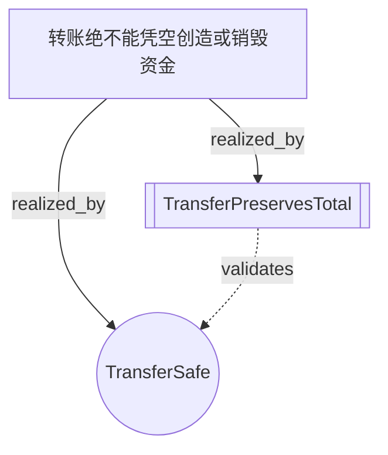
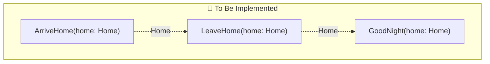

# Intent-Lang 可视化工具 - 项目总结

## 🎯 项目目标

为 intent-lang 创建一个可视化工具，将业务意图（.intent文件）转换为直观的图形展示，帮助理解和分析需求结构。

## ✅ 已实现功能

### 1. 五种可视化类型

#### Goal Graph（目标依赖图）
- 展示业务目标 → 安全规则 → 意图 → 定理的实现链路
- 支持多种节点形状和颜色区分
- 显示realized_by、validates、enforces等关系

#### Intent Graph（意图关系图）
- 按@tobe/@asis注解分组展示意图
- 显示意图之间的数据流（通过共享类型）
- 统计每个意图的require/ensure/invariant子句数量

#### Safety Network（安全规则网络）
- 展示安全规则覆盖的类型
- 显示规则与类型之间的约束关系
- 帮助审计安全规则的完备性

#### Coverage Matrix（完备性矩阵）
- 可视化coverage声明的多维度测试场景
- 计算总组合数、已覆盖数、缺失数
- 支持2D矩阵表格和N维列表展示

#### Verification Flow（验证流程图）
- 展示单个intent的验证条件生成过程
- 显示preconditions → invariants → postconditions → VC
- 帮助理解和调试验证逻辑

### 2. 四种输出格式

- **Mermaid** - Markdown可嵌入，GitHub/Notion/GitLab原生支持
- **Graphviz DOT** - 适合复杂图形，可转换为PNG/SVG
- **JSON** - 适合Web应用集成（D3.js等）
- **SVG** - 独立图片，可直接插入文档

### 3. 交互式HTML生成

- 多标签页切换不同可视化类型
- 彩色图形和响应式布局
- 源代码对照查看
- 独立HTML文件，无需服务器

### 4. 批量处理模式

- `--all` 模式一次生成所有可视化类型
- 自动生成索引页面
- 适合CI/CD集成

## 📁 项目结构

```
tools/visualizer/
├── Cargo.toml              # 依赖配置
├── README.md               # 工具概述
├── GUIDE.md                # 详细使用指南
├── demo.sh                 # 演示脚本
└── src/
    ├── main.rs             # CLI入口和参数解析
    ├── goal_graph.rs       # 目标依赖图构建器
    ├── intent_graph.rs     # 意图关系图构建器
    ├── coverage_matrix.rs  # 完备性矩阵构建器
    ├── mermaid.rs          # Mermaid格式渲染器
    ├── graphviz.rs         # Graphviz DOT渲染器
    └── html_generator.rs   # HTML生成器
```

## 🔧 技术栈

- **Rust** - 类型安全和高性能
- **intent-lang-syntax** - 复用现有的AST解析器
- **clap** - 命令行参数解析
- **serde/serde_json** - 数据序列化
- **Mermaid.js** - 交互式图形渲染
- **Graphviz** - 高级图形布局（可选依赖）

## 💡 核心设计

### 模块化架构
每种可视化类型独立实现，易于扩展新类型。

### Trait抽象
- `GraphData` - 所有图形数据的JSON序列化
- `MermaidRenderable` - Mermaid格式渲染
- `DotRenderable` - Graphviz格式渲染

### 渐进式增强
- 基础功能只需Rust工具链
- 高级功能（SVG生成）需要Graphviz
- 用户可根据需求选择安装

## 📊 使用示例

### 命令行使用

```bash
# 生成目标依赖图
intent-lang-visualizer examples/basics/transfer.intent --type goal-graph

# 生成交互式HTML
intent-lang-visualizer transfer.intent --interactive -o viz.html

# 批量生成所有可视化
intent-lang-visualizer billing.intent --all --output-dir ./viz
```

### 集成到工作流

#### CI/CD自动生成
```yaml
- name: Generate visualizations
  run: |
    for file in **/*.intent; do
      intent-lang-visualizer "$file" --all --output-dir "docs/viz/$(basename $file .intent)"
    done
```

#### Pre-commit Hook
```bash
intent-lang-visualizer "$file" --type goal-graph \
  -o "docs/$(basename $file .intent)-viz.mmd"
```

## 🎨 可视化示例

### 转账系统目标依赖图


### 智能家居意图关系图


## 📈 价值和影响

### 对开发团队
- **提高理解效率** - 图形化展示比纯文本更直观
- **加速onboarding** - 新成员快速掌握系统结构
- **支持重构** - 识别高耦合模块和循环依赖
- **文档自动化** - 从代码生成最新的架构图

### 对产品团队
- **需求追溯** - 清晰看到每个需求的实现路径
- **PRD评审** - 可视化业务目标和约束关系
- **gap分析** - 识别未实现的目标和缺失的测试场景

### 对合规审计
- **安全审查** - 展示所有安全规则的覆盖范围
- **测试覆盖** - 量化多维度测试场景的完备性
- **变更影响** - 理解修改某个意图的下游影响

## 🚀 未来扩展方向

### 短期（1-2周）
- [ ] 添加`refines`关系的可视化（L1→L2→L3精化链）
- [ ] 支持过滤和搜索（只显示特定goal/intent）
- [ ] 增加实时预览模式（watch模式）

### 中期（1-2月）
- [ ] 集成到Web Playground（WASM编译）
- [ ] 支持diff可视化（对比两个版本的变化）
- [ ] 添加统计仪表板（complexity metrics）
- [ ] 支持自定义主题和样式

### 长期（3-6月）
- [ ] 3D可视化（复杂系统的层次结构）
- [ ] 动画演示（验证流程的step-by-step）
- [ ] AI辅助布局优化
- [ ] 协作功能（多人标注和讨论）

## 📝 总结

intent-lang-visualizer 成功实现了将抽象的业务意图转换为直观图形的目标，提供了：

✅ **5种可视化类型** 覆盖不同分析需求  
✅ **4种输出格式** 适配不同使用场景  
✅ **交互式HTML** 提供最佳用户体验  
✅ **CI/CD集成** 支持自动化工作流  
✅ **完善文档** 包含使用指南和示例  

该工具已经可以投入实际使用，帮助团队更好地理解、分析和交流业务意图。

## 🔗 相关资源

- 工具使用指南: `tools/visualizer/GUIDE.md`
- 可视化示例: `examples/viz/README.md`
- 演示脚本: `tools/visualizer/demo.sh`
- Intent-Lang文档: `docs/lang/README.md`
